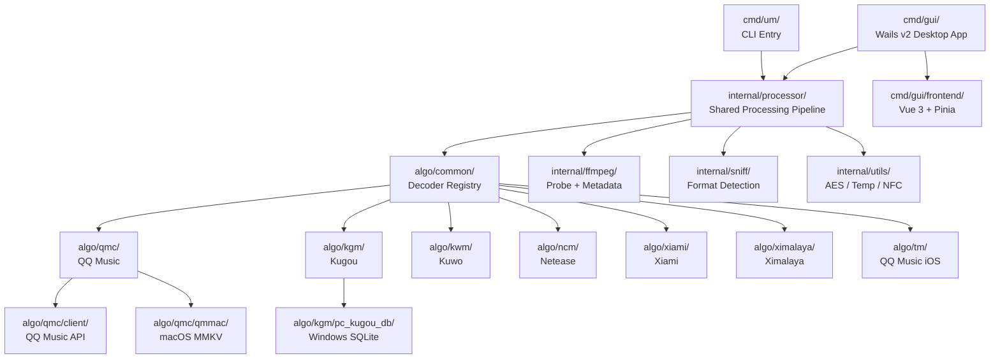
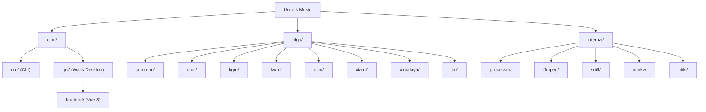

# Unlock Music — AI Context

> Updated: 2026-06-07 | Module: `git.um-react.app/um/cli` | Go 1.26.0 + Vue 3

## What Is This

Desktop and CLI tool that decrypts DRM-encrypted music files from Chinese streaming platforms (QQ Music, Kugou, Kuwo, Netease, Xiami, Ximalaya). Two entry points: a CLI tool (`cmd/um`) and a Wails v2 GUI desktop app (`cmd/gui`) sharing the same decryption pipeline. Outputs clean audio with restored metadata and cover art.

## Architecture



## Module Structure



## Module Index

| Module | Path | Language | Description |
|--------|------|----------|-------------|
| CLI Entry | `cmd/um/` | Go | CLI tool with urfave/cli, watch mode, batch processing |
| GUI Backend | `cmd/gui/` | Go | Wails v2 app struct, Go-to-JS bindings, settings persistence |
| GUI Frontend | `cmd/gui/frontend/` | Vue 3 + TS | Desktop UI: drag-and-drop, file queue, settings, log viewer |
| Processor | `internal/processor/` | Go | Shared pipeline: file dispatch, decrypt, metadata, progress hooks |
| FFmpeg | `internal/ffmpeg/` | Go | ffprobe/ffmpeg wrappers, metadata writing, album art |
| Sniff | `internal/sniff/` | Go | Audio/image format detection by magic bytes |
| MMKV | `internal/mmkv/` | Go | MMKV binary format parser for QQ Music keys |
| Utils | `internal/utils/` | Go | AES-128-ECB, temp files, Unicode NFC normalization |
| Algo Common | `algo/common/` | Go | Decoder registry, interfaces, file extension dispatch |
| QMC | `algo/qmc/` | Go | QQ Music: RC4, Map cipher, Static XOR, key derivation |
| KGM | `algo/kgm/` | Go | Kugou: v3 XOR, v5 Windows SQLite |
| KWM | `algo/kwm/` | Go | Kuwo: XOR mask |
| NCM | `algo/ncm/` | Go | Netease: AES-128-ECB + RC4 box |
| Xiami | `algo/xiami/` | Go | Xiami: single-byte XOR |
| Ximalaya | `algo/ximalaya/` | Go | Ximalaya: scramble table + XOR |
| TM | `algo/tm/` | Go | QQ Music iOS: header replacement |

## Key Design Patterns

- **Plugin registry**: Each `algo/*` package self-registers via `init()` -> `common.RegisterDecoder(ext, isNoop, factory)`
- **Blank imports**: Both `cmd/um/main.go` and `cmd/gui/main.go` import algo packages as `_` to trigger registration
- **Decoder interface**: `Validate() error` + `io.Reader` -- stream-oriented, no full-file buffering
- **Shared processor**: `internal/processor/` extracted from CLI, used by both CLI and GUI with callback hooks
- **Event-driven GUI**: Go backend emits Wails events (`file:event`, `file:progress`, `log`, `processing:done`); Vue frontend listens via `window.runtime.EventsOn()`
- **Platform-specific code**: Build tags for `kgm/pc_kugou_db` (Windows-only SQLite), `qmc/qmmac` (macOS-only MMKV), `ffmpeg/hide_windows.go` (suppress console window)

## Quick Commands

```bash
# CLI
go test -v ./...                    # Run all tests
go build ./cmd/um                   # Build CLI binary
./um -i <input> -o <out>            # Decrypt files
./um --watch -i <dir>               # Watch mode

# GUI
cd cmd/gui && wails dev             # Dev mode with hot reload
cd cmd/gui && wails build           # Production build
npm install --prefix cmd/gui/frontend  # Install frontend deps
```

## File Extension -> Algorithm Mapping

| Extensions | Package | Cipher |
|-----------|---------|--------|
| `.qmc*`, `.mgg*`, `.mflac*`, `.tkm` | `algo/qmc` | RC4 / Map / Static XOR |
| `.kgm`, `.kgma`, `.vpr` | `algo/kgm` | KGM v3 XOR |
| `.kgg` | `algo/kgm` | KGM v5 (Windows-only DB) |
| `.kwm` | `algo/kwm` | XOR mask |
| `.ncm` | `algo/ncm` | AES-128-ECB + RC4 box |
| `.xm` | `algo/xiami` | Single-byte XOR |
| `.x2m`, `.x3m` | `algo/ximalaya` | Scramble table + XOR |
| `.tm0`, `.tm2`, `.tm3`, `.tm6` | `algo/tm` | Header replacement |

## Module Docs

- [algo/CLAUDE.md](algo/CLAUDE.md) -- Decryption algorithm packages
- [internal/CLAUDE.md](internal/CLAUDE.md) -- Internal support packages (incl. processor)
- [cmd/um/CLAUDE.md](cmd/um/CLAUDE.md) -- CLI entry point
- [cmd/gui/CLAUDE.md](cmd/gui/CLAUDE.md) -- Wails GUI backend
- [cmd/gui/frontend/CLAUDE.md](cmd/gui/frontend/CLAUDE.md) -- Vue 3 frontend

## Dependencies (Key)

| Package | Role |
|---------|------|
| `urfave/cli/v2` | CLI framework |
| `wailsapp/wails/v2` | Desktop GUI framework (Go + WebView) |
| `go.uber.org/zap` | Structured logging |
| `golang.org/x/crypto` | TEA cipher (QMC key derivation) |
| `modernc.org/sqlite` | Pure-Go SQLite (Kugou v5, Windows) |
| `unlock-music/go-mmkv` | MMKV parser (QQ Music keys) |
| `fsnotify/fsnotify` | File system watcher (CLI watch mode, GUI) |
| `samber/lo` | Generic utilities |
| `vue` (3.5) | Frontend framework |
| `pinia` (2.3) | Vue state management |
| `vite` (6.x) | Frontend build tool |

## Testing Strategy

- Go unit tests in `algo/` packages (cipher correctness with binary fixtures in `testdata/`) plus malformed/crafted-input regression tests across the pipeline.
- 19 test files:
  - `algo/common/meta_test.go`, `algo/common/dispatch_test.go`
  - `algo/qmc/cipher_map_test.go`, `cipher_rc4_test.go`, `key_derive_test.go`, `qmc_test.go`, `qmc_footer_musicex_test.go` (crafted musicex footer)
  - `algo/kgm/kgm_header_test.go` (crafted v5 header), `algo/kgm/pc_kugou_db/cipher_windows_test.go` (Windows-only, `//go:build windows`)
  - `algo/kwm/kwm_test.go` (bitrate/type parsing, padOrTruncate), `algo/ncm/ncm_test.go` (crafted `.ncm` Validate)
  - `internal/processor/processor_test.go` (progressReader, hooks, status, panic recovery via a stub decoder)
  - `internal/utils/crypto_test.go` (PKCS7/AES bad input), `temp_test.go`
  - `internal/sniff/sniff_test.go` (short header, jpeg/webp), `internal/ffmpeg/options_test.go` (arg builder), `meta_flac_test.go` (tag-preservation + single-cover round-trip)
  - `cmd/gui/app_test.go` (drop resolution), `cmd/gui/logsink_test.go` (log tee)
- No frontend tests currently (Vue components untested).
- Crafted-input tests assert decoders return errors rather than panicking; the processor wraps each file in `recover()` as a final backstop.

## Coding Conventions

- Go: standard library style, `zap` for logging, context for cancellation
- Frontend: Vue 3 Composition API with `<script setup>`, Pinia stores, TypeScript strict mode
- CSS: custom design tokens via CSS variables (`tokens.css`), no component library
- Dark theme only (hardcoded in `tokens.css`)

## AI Usage Notes

- The `internal/processor/` package is the central pipeline -- changes here affect both CLI and GUI
- `algo/` packages are self-contained; each can be understood independently
- Frontend communicates with Go exclusively through Wails bindings (`window.go.main.App.*`) and runtime events (`window.runtime.EventsOn`)
- Platform-specific files use Go build tags (`//go:build windows`, `//go:build darwin`)
- Binary test fixtures in `algo/qmc/testdata/` should not be read as text

## CI/CD

Gitea Actions (`.gitea/workflows/build.yml`): test -> cross-compile 6 CLI targets (linux/darwin/windows x amd64/arm64) -> archive with checksums. GUI build not yet in CI (requires native WebView per platform).

## Changelog

| Date | Change |
|------|--------|
| 2026-06-08 | Bundled ffmpeg now cross-compiles for windows/amd64+arm64 and linux/amd64+arm64 (`build/ffmpeg/build.sh` gained cross-prefix/cc/arch/target-os + from-source static zlib; added `embed_{windows_arm64,linux_amd64,linux_arm64}.go`); macOS stays on PATH fallback |
| 2026-06-07 | Migrated baseline to Go 1.26; hardened decoders against crafted files (recover() backstop, bounds/padding/key checks across crypto, ncm, qmc, kgm, kwm, ximalaya); fixed FLAC tag-loss + duplicate-cover; fixed KGG cache race; expanded tests 8 -> 19; removed dead `internal/logging`; scoped CI to non-GUI packages |
| 2026-06-07 | Corrected Testing Strategy: 6 -> 8 test files (added `algo/common/dispatch_test.go`, `internal/processor/processor_test.go`); refined processor-test note |
| 2026-05-04 | Updated root CLAUDE.md: added GUI module, processor package, frontend docs, module structure diagram, updated architecture |
| 2026-04-21 | Initial CLAUDE.md generation (CLI-only) |
