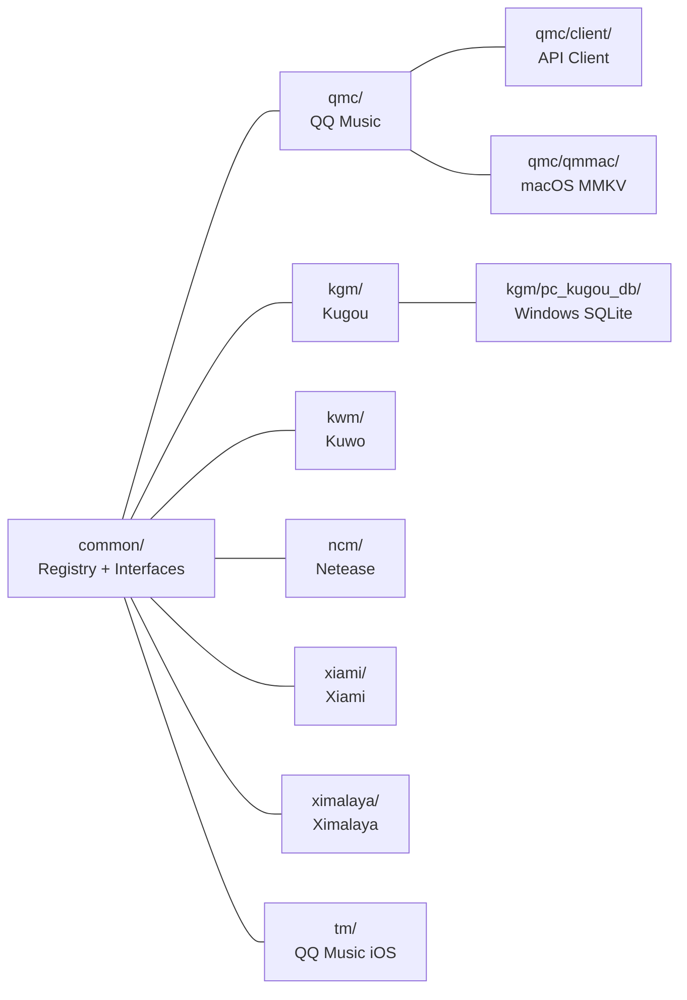

[Root](../CLAUDE.md) > **algo**

# algo/ -- Decryption Algorithm Packages

> Updated: 2026-05-04

## Structure



## common/ -- Decoder Registry and Shared Types

| File | Purpose |
|------|---------|
| `dispatch.go` | `RegisterDecoder(ext, noop, factory)` -- global registry; `GetDecoder(filename, skipNoop)` -- matches extension suffix to decoder factories |
| `interface.go` | Core interfaces: `Decoder` (`Validate() error` + `io.Reader`), `StreamDecoder` (`Decrypt(buf, offset)`), `AudioMeta`, `AudioMetaGetter`, `CoverImageGetter` |
| `raw.go` | `RawDecoder` -- passthrough (noop) decoder for already-decrypted files |
| `meta.go` | `ParseFilenameMeta(filename)` -- extracts artist/title from "Artist - Title" patterns |
| `meta_test.go` | Tests for filename metadata parsing |

Key types:
```go
type CryptoParams struct { KggDbPath string; QmcKeys QMCKeys }
type DecoderParams struct { Reader io.ReadSeeker; Extension string; FilePath string; Logger *zap.Logger; CryptoParams }
type DecoderFactory struct { noop bool; Suffix string; Create NewDecoderFunc }
```

## qmc/ -- QQ Music (Most Complex)

Three cipher implementations:
- `cipher_static.go`: Static XOR table (legacy `.qmc0`)
- `cipher_map.go`: Map cipher -- key-derived substitution table
- `cipher_rc4.go`: RC4-variant stream cipher -- segmented with first-segment special handling

Key management:
- `key_derive.go`: `deriveKey()` -- TEA-based key derivation from encrypted ekey
- `key_mmkv_loader_darwin.go` / `key_mmkv_loader_default.go`: Platform-specific MMKV loading
- `qmc.go`: Main decoder -- detects suffix tag (STag/QTag/musicex), selects cipher
- `qmc_footer_musicex.go`: Parse MusicEx footer format
- `qmc_meta.go`: Metadata extraction from QMC files

Sub-packages:
- `client/`: HTTP client for QQ Music API (track info, search, album art, CDN URLs) -- `base.go`, `cover.go`, `search.go`, `track.go`
- `qmmac/`: macOS-specific MMKV key loading for QQ Music v8 (`v8_darwin.go`) and v10 (`v10_darwin.go`)

Tests: `cipher_map_test.go`, `cipher_rc4_test.go`, `key_derive_test.go`, `qmc_test.go` with 20 binary fixtures in `testdata/`

## kgm/ -- Kugou

| File | Purpose |
|------|---------|
| `kgm.go` | Main decoder, version detection |
| `kgm_header.go` | Header parsing |
| `kgm_v3.go` | v3 XOR cipher with slot-based key table |
| `kgm_v5.go` | v5 (KGG) -- delegates to pc_kugou_db |
| `pc_kugou_db/cipher_windows.go` | Windows-only: reads ekeys from Kugou SQLite DB, AES-CBC page decryption |
| `pc_kugou_db/cipher_default.go` | Non-Windows stub |
| `pc_kugou_db/cipher_windows_test.go` | Windows cipher tests |

## kwm/ -- Kuwo

| File | Purpose |
|------|---------|
| `kwm.go` | Main decoder, XOR mask |
| `kwm_cipher.go` | 32-byte repeating key derived from resource ID |

## ncm/ -- Netease Cloud Music

| File | Purpose |
|------|---------|
| `ncm.go` | Main decoder: AES-128-ECB key decryption -> RC4-like box cipher for audio |
| `ncm_cipher.go` | RC4 box cipher implementation |
| `meta.go` | Embedded JSON metadata + cover image URL extraction |

## xiami/ -- Xiami

| File | Purpose |
|------|---------|
| `xm.go` | Main decoder |
| `xm_cipher.go` | Single-byte XOR with file-offset modulation |

## ximalaya/ -- Ximalaya

| File | Purpose |
|------|---------|
| `ximalaya.go` | Main decoder, header-only XOR |
| `x2m_crypto.go` | X2M cipher with embedded scramble table |
| `x3m_crypto.go` | X3M cipher with embedded scramble table |

Binary data: `x2m_scramble_table.bin`, `x3m_scramble_table.bin` (embedded via `//go:embed`)

## tm/ -- QQ Music iOS

| File | Purpose |
|------|---------|
| `tm.go` | Header replacement -- strips TM header, restores original audio header bytes |

## Changelog

| Date | Change |
|------|--------|
| 2026-05-04 | Updated: added file-level detail tables, breadcrumb, interface details |
| 2026-04-21 | Initial CLAUDE.md |
