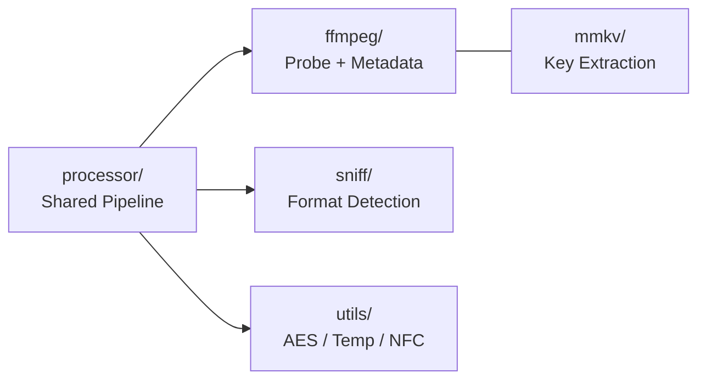

[Root](../CLAUDE.md) > **internal**

# internal/ -- Internal Support Packages

> Updated: 2026-05-04

## Structure



## processor/ -- Shared Processing Pipeline (NEW)

Extracted from `cmd/um/main.go` to be shared between CLI and GUI entry points.

### Files

| File | Purpose |
|------|---------|
| `processor.go` | `Processor` struct with `ProcessFile`, `ProcessDir`, `WatchDir` methods |
| `config.go` | `Config` struct (input/output dirs, flags, crypto params) |
| `hooks.go` | `Hooks` callback interface (`OnFileEvent`, `OnProgress`, `OnLog`) + `FileEvent`/`ProgressEvent` types + `FileStatus` constants |
| `progress.go` | `progressReader` -- wraps `io.Reader` to emit byte-level progress, throttled to 100ms |

### Processing Pipeline (`ProcessFile`)

1. Match decoders via `common.GetDecoder(filename, skipNoop)`
2. Find valid decoder: iterate candidates, call `Validate()`, use first success
3. Emit `StatusDecrypting`, wrap decoder in `progressReader`
4. Read 64-byte header, sniff audio format via `sniff.AudioExtensionWithFallback`
5. If `UpdateMetadata` enabled and decoder implements `AudioMetaGetter`: fetch metadata, write to temp file
6. If metadata includes cover and decoder implements `CoverImageGetter`: fetch cover image
7. Write output: direct copy (no metadata) or `ffmpeg.UpdateMeta()` (with metadata)
8. Emit `StatusDone` with output path

### Event System

```go
type FileStatus string  // "queued", "validating", "decrypting", "metadata", "writing", "done", "skipped", "failed"

type FileEvent struct {
    Path       string
    Status     FileStatus
    OutputPath string
    AudioExt   string
    Error      error
}

type ProgressEvent struct {
    Path    string
    Current int64
    Total   int64
}

type Hooks struct {
    OnFileEvent func(FileEvent)
    OnProgress  func(ProgressEvent)
    OnLog       func(level string, msg string)
}
```

CLI uses empty hooks (noop defaults). GUI wires hooks to `wailsRuntime.EventsEmit()`.

### WatchDir

Uses `fsnotify` watcher. First runs `ProcessDir` on existing files, then watches for `Create`/`Write` events. Waits for exclusive file lock before processing (handles files still being written).

## ffmpeg/ -- Audio Processing Wrappers

| File | Purpose |
|------|---------|
| `ffmpeg.go` | `ExtractAlbumArt()`, `UpdateMeta()` -- ffmpeg command wrappers for metadata writing |
| `ffprobe.go` | `ProbeReader()` -- JSON probe for format/tags/streams via stdin pipe |
| `meta_flac.go` | `updateMetaFlac()` -- native FLAC metadata writing via `go-flac` (avoids ffmpeg for FLAC) |
| `options.go` | `ffmpegBuilder` / `inputBuilder` / `outputBuilder` -- fluent builder for ffmpeg CLI args |
| `hide_windows.go` | `hideWindow()` -- sets `CREATE_NO_WINDOW` on Windows to suppress console popup |
| `hide_other.go` | `hideWindow()` -- no-op on non-Windows |

Key: FLAC metadata is written natively (no ffmpeg dependency for FLAC). Other formats (MP3, M4A, WAV, OGG) use ffmpeg.

## sniff/ -- Audio Format Detection

| File | Purpose |
|------|---------|
| `audio.go` | `AudioExtensionWithFallback(header, fallback)` -- detect format by magic bytes (MP3, FLAC, OGG, WAV, M4A/AAC, WMA, DFF) |
| `image.go` | `ImageExtension(data)` -- detect image format (JPEG, PNG, GIF, BMP, WebP) |

## mmkv/ -- MMKV Key Store Reader

| File | Purpose |
|------|---------|
| `mmkv.go` | `ReadMMKVFile(path)` -- parse MMKV binary format, extract key-value pairs |

Used by QMC decoder to load encryption keys from QQ Music's local storage.

## utils/ -- Shared Utilities

| File | Purpose |
|------|---------|
| `crypto.go` | `DecryptAES128ECB` / `PKCS7UnPadding` -- AES-128-ECB with validated PKCS7 unpadding (both return errors on bad input) |
| `temp.go` | `WriteTempFile(reader, ext)` -- write reader to temp file, return path (cleans up on error) |
| `unicode.go` | `NormalizeUnicode(s)` -- Unicode NFC normalization for filename matching |

## Changelog

| Date | Change |
|------|--------|
| 2026-05-04 | Updated: added processor package docs, ffmpeg file details (hide_windows, options, meta_flac), updated structure diagram |
| 2026-04-21 | Initial CLAUDE.md |
